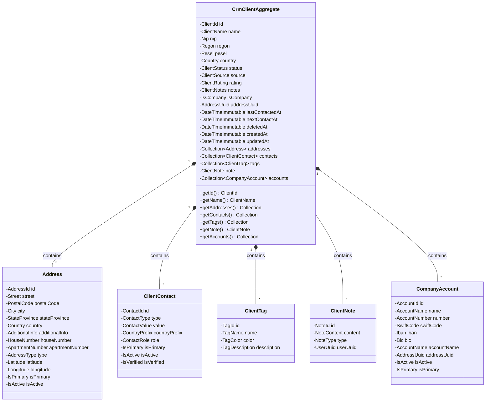

## Analiza wymagań

Agregat `CrmClientAggregate` ma być:

- Read-only reprezentantem (tylko gettery, bez setterów)
- Zawierać te same parametry co encja Client (ale jako Value Objects)
- Zawierać kolekcje: Address[], ClientContact[], ClientTag[], CompanyAccount[]
- Zawierać pojedynczy ClientNote (1 do 1, nie kolekcja)
- Wszystkie kolumny mają być reprezentowane jako Value Objects

## Struktura agregatu

### Kolekcje (1 do wielu):

- `Collection<Address>` - adresy klienta
- `Collection<ClientContact>` - kontakty klienta
- `Collection<ClientTag>` - tagi klienta
- `Collection<CompanyAccount>` - konta bankowe

### Pojedyncze obiekty (1 do 1):

- `ClientNote` - pojedyncza notatka (prawdopodobnie ostatnia lub główna)

### Parametry główne (z Client):

- Wszystkie pola z encji Client jako Value Objects

## Value Objects do utworzenia

### ID jako UUID (wszystkie z możliwością generowania UUID v7):

1. **ClientId** - UUID klienta (z generowaniem UUID v7)
2. **AddressId** - UUID adresu (z generowaniem UUID v7)
3. **ContactId** - UUID kontaktu (z generowaniem UUID v7)
4. **NoteId** - UUID notatki (z generowaniem UUID v7)
5. **TagId** - UUID tagu (z generowaniem UUID v7)
6. **AccountId** - UUID konta bankowego (z generowaniem UUID v7)
7. **UserId** - UUID użytkownika (z generowaniem UUID v7)

### Dla Client:

1. **ClientName** - nazwa klienta (string)
2. **Nip** - numer NIP (string z walidacją)
3. **Regon** - numer REGON (nullable string)
4. **Pesel** - numer PESEL (nullable string)
5. **Country** - kraj (string)
6. **ClientSource** - źródło klienta (nullable string)
7. **ClientRating** - ocena 1-5 (nullable int z walidacją)
8. **ClientNotes** - notatki (nullable string)
9. **IsCompany** - czy to firma (bool)
10. **AddressUuid** - UUID adresu (nullable AddressId)

### Dla Address:

1. **Street** - ulica (string)
2. **PostalCode** - kod pocztowy (string)
3. **City** - miasto (string)
4. **StateProvince** - województwo (string)
5. **Country** - kraj (string) - może być wspólny z Client
6. **AdditionalInfo** - dodatkowe informacje (string)
7. **HouseNumber** - numer domu (string)
8. **ApartmentNumber** - numer mieszkania (string)
9. **Latitude** - szerokość geograficzna (nullable float)
10. **Longitude** - długość geograficzna (nullable float)
11. **IsPrimary** - czy główny (bool)
12. **IsActive** - czy aktywny (bool)

### Dla ClientContact:

1. **ContactValue** - wartość kontaktu (string)
2. **CountryPrefix** - prefiks kraju (nullable string, max 5 znaków)

### Dla ClientNote:

1. **NoteContent** - treść notatki (string)
2. **UserId** - UUID użytkownika (UserId Value Object)

### Dla ClientTag:

1. **TagName** - nazwa tagu (string)
2. **TagColor** - kolor hex (nullable string, format #RRGGBB)
3. **TagDescription** - opis (nullable string)

### Dla CompanyAccount:

1. **AccountName** - nazwa konta (string)
2. **AccountNumber** - numer konta (string)
3. **SwiftCode** - kod SWIFT (string)
4. **Iban** - numer IBAN (string)
5. **Bic** - kod BIC (string)
6. **AccountName** - nazwa konta bankowego (string)

## Struktura plików

```
src/App/Crm/Domain/
├── Aggregate/
│   └── CrmClientAggregate.php (poprawić nazwę z ClientAgregate)
└── ValueObject/
    ├── ClientId.php (UUID v7)
    ├── AddressId.php (UUID v7)
    ├── ContactId.php (UUID v7)
    ├── NoteId.php (UUID v7)
    ├── TagId.php (UUID v7)
    ├── AccountId.php (UUID v7)
    ├── UserId.php (UUID v7)
    ├── ClientName.php
    ├── Nip.php
    ├── Regon.php
    ├── Pesel.php
    ├── Country.php
    ├── ClientSource.php
    ├── ClientRating.php
    ├── ClientNotes.php
    ├── IsCompany.php
    ├── AddressUuid.php
    ├── Street.php
    ├── PostalCode.php
    ├── City.php
    ├── StateProvince.php
    ├── AdditionalInfo.php
    ├── HouseNumber.php
    ├── ApartmentNumber.php
    ├── Latitude.php
    ├── Longitude.php
    ├── ContactValue.php
    ├── CountryPrefix.php
    ├── NoteContent.php
    ├── TagName.php
    ├── TagColor.php
    ├── TagDescription.php
    ├── AccountName.php
    ├── AccountNumber.php
    ├── SwiftCode.php
    ├── Iban.php
    └── Bic.php
```

## Implementacja agregatu

Agregat będzie miał:

- Konstruktor przyjmujący wszystkie Value Objects i kolekcje
- Metodę factory `fromEntities()` do tworzenia z encji Internal
- Tylko gettery (read-only)
- Kolekcje jako `array` lub dedykowane klasy kolekcji
- Immutability - agregat nie może być modyfikowany po utworzeniu

## Diagram struktury agregatu



## UUID v7 - Implementacja

Wszystkie Value Objects dla ID będą:

- Immutable
- Zawierać walidację formatu UUID
- Mieć metodę statyczną `generate()` do generowania UUID v7
- Mieć metodę `fromString(string $uuid)` do tworzenia z istniejącego UUID
- Implementować `__toString()` dla łatwej konwersji na string

Przykład struktury:

```php
final class ClientId
{
    private function __construct(private readonly string $value) {}
    
    public static function generate(): self // Generuje UUID v7
    public static function fromString(string $uuid): self
    public function toString(): string
    public function __toString(): string
}
```

**UUID v7** - Time-ordered UUID:

- Sortowalny czasowo (lepsze dla indeksów bazy danych)
- Zawiera timestamp w pierwszych 48 bitach
- Kompatybilny z RFC 4122
- Wymaga biblioteki do generowania (np. `symfony/uid` lub `ramsey/uuid`)

**Uwaga**: Projekt nie ma obecnie biblioteki UUID w `composer.json`. Należy dodać jedną z:

- `symfony/uid` (zalecane dla Laravel 11, ma natywne wsparcie dla UUID v7)
- `ramsey/uuid` (wymaga dodatkowej biblioteki dla UUID v7, np. `symfony/uid`)

Przykład dodania do composer.json:

```json
"require": {
    "symfony/uid": "^7.0"
}
```

## Uwagi implementacyjne

1. **Value Objects** powinny być immutable i zawierać walidację
2. **Kolekcje** mogą być zwykłymi tablicami lub dedykowanymi klasami (np. `AddressCollection`)
3. **Agregat** nie powinien mieć setterów - tylko gettery
4. **Factory method** `fromEntities()` będzie przyjmować encje Internal i tworzyć agregat
5. **UUID Value Objects** będą reprezentować wszystkie ID z możliwością generowania UUID v7
6. **DateTime** pozostaje jako `DateTimeImmutable` (nie Value Object, chyba że wymagane)
7. **UUID v7** wymaga dodania biblioteki `symfony/uid` do projektu